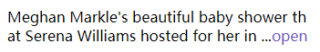
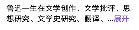

### This is a component that can show long text, and show 'open' or 'close' text. But I recommend you can get the source, rather than npm install it. If it can help you, you can star it

#### This results

### 一个用来显示长文本的组件，如果有需要可以折叠文本显示n行，并在结尾显示“展开”、“收起”。但是我推荐你直接获取源码，而不是npm install。如果你喜欢可以star

#### 结果展示

